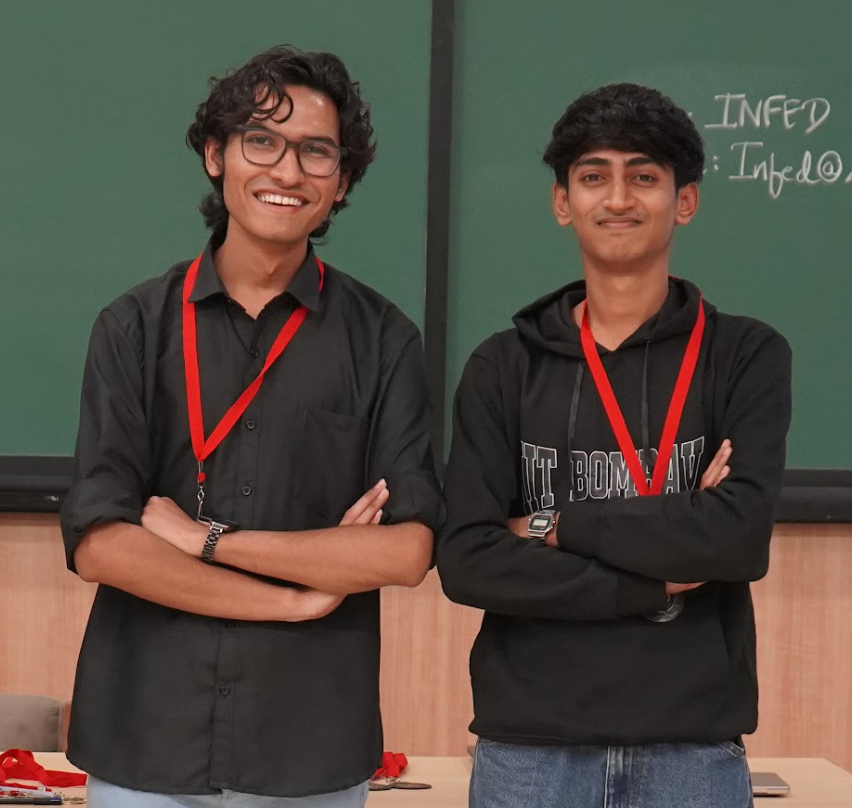
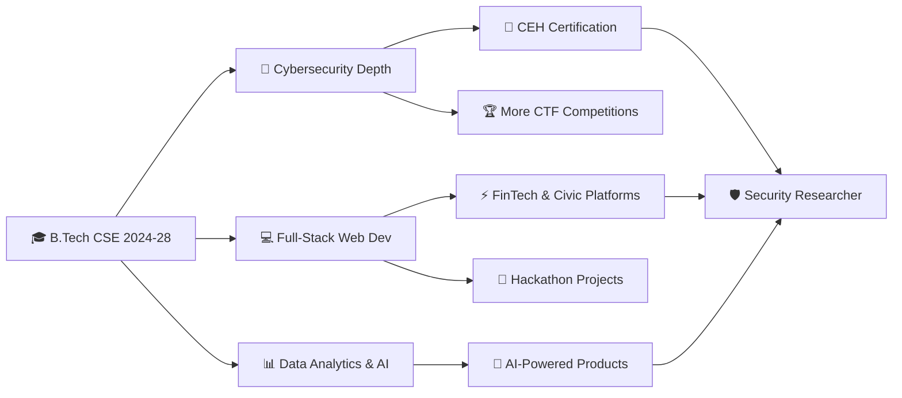

<!-- Header Wave Animation -->
<p align="center">
  
</p>

<!-- Hero Photo -->
<p align="center">
  
</p>

<!-- Typing Animation -->
<p align="center">
  
</p>

<!-- Social Badges -->
<p align="center">
  <a href="https://vinmannotes.shop" target="_blank">
    
  </a>
  <a href="https://www.linkedin.com/in/vinmandev" target="_blank">
    
  </a>
  <a href="mailto:vineet.mandhalkar@gmail.com">
    
  </a>
  <a href="https://github.com/vinman2006" target="_blank">
    
  </a>
</p>

<!-- Quick Stats Badges -->
<p align="center">
  
  
  
  
  
</p>

<br>

<!-- Snake Animation -->
<p align="center">
  <picture>
    <source media="(prefers-color-scheme: dark)" srcset="https://raw.githubusercontent.com/vinman2006/vinman2006/output/github-contribution-grid-snake-dark.svg" />
    <source media="(prefers-color-scheme: light)" srcset="https://raw.githubusercontent.com/vinman2006/vinman2006/output/github-contribution-grid-snake.svg" />
    
  </picture>
</p>

---

## 👨‍💻 About Me


- 🎓 **BTech CSE Student** @ KDK College of Engineering, Nagpur *(2024 – 2028)*
- 🏛️ Affiliated: **Rashtrasant Tukadoji Maharaj Nagpur University (RTMNU)**
- 🚀 **10+ Hackathons** | Core Member of **CoDevians**
- 🤝 **10+ Tech Event Volunteering Experiences**
- 🔐 Deep passion for **Cybersecurity, Ethical Hacking & OSINT**
- 💡 Love **rapid prototyping & turning ideas into working products**
- 📊 Exploring **FinTech, Civic Tech & AI-powered Web Development**
- 🌐 Personal Vault: **[vinmannotes.shop](https://vinmannotes.shop)**
- ☠️ *"Whatever happens, Death Note should remain constant."*

<br clear="right"/>

---

## 📊 GitHub Statistics

<p align="center">
  
  &nbsp;
  
</p>

<p align="center">
  
</p>

---

## 🏆 GitHub Trophies

<p align="center">
  
</p>

---

## 📈 Contribution Activity Graph

<p align="center">
  
</p>

---

## 🛠️ Tech Stack & Tools

<p align="center">
  <b>Languages</b><br/><br/>
  
</p>

<p align="center">
  <b>Frameworks & Libraries</b><br/><br/>
  
</p>

<p align="center">
  <b>Tools & Platforms</b><br/><br/>
  
</p>

<!-- Skill Progress Bars -->
<details>
<summary><b>📊 Skill Proficiency Breakdown (click to expand)</b></summary>
<br/>

**🌐 Web Development**
```text
HTML / CSS        ████████████████░░░  85%
JavaScript        ██████████████░░░░░  75%
React             ████████████░░░░░░░  65%
Node.js           ████████████░░░░░░░  65%
Next.js           ██████████░░░░░░░░░  55%
```

**💻 Programming Languages**
```text
Python            ████████████████░░░  85%
C / C++           ██████████████░░░░░  75%
Java              ████████████░░░░░░░  60%
JavaScript        ██████████████░░░░░  75%
```

**🔐 Cybersecurity & OSINT**
```text
Ethical Hacking   ████████████░░░░░░░  65%
OSINT Techniques  ██████████████░░░░░  75%
Cyber Forensics   ████████████░░░░░░░  65%
Network Security  ██████████░░░░░░░░░  55%
CTF Strategy      █████████░░░░░░░░░░  50%
```

**🧩 Soft Skills & Leadership**
```text
Technical Pitch   ████████████████░░░  85%
Team Management   ████████████████░░░  85%
Presentations     ███████████████░░░░  80%
System Integration████████████████░░░  85%
Event Management  ██████████████████░  90%
```

</details>

---

## 🏅 Hackathon & Build Vault

> 🔥 10+ hackathons competed | 24-hour sprints | Multi-domain innovation | Core CoDevians team

<table>
<thead>
<tr>
<th>🚀 Project</th>
<th>📁 Domain / Event</th>
<th>⚙️ Tech Stack</th>
<th>🎯 Key Role & Impact</th>
</tr>
</thead>
<tbody>
<tr>
<td><b>Codevians InfraBond</b> 🔗 <a href="https://codevians.online">Live</a></td>
<td>FinTech / SDG 9<br/><i>Central India Hackathon 3.0</i></td>
<td><code>Next.js</code> <code>Express.js</code> <code>Azure</code></td>
<td>Tokenized public-private infrastructure bonds. Led system integration, deployment & pitch deck.</td>
</tr>
<tr>
<td><b>MyNagpur / Majha Nagpur</b></td>
<td>Civic Tech / Analytics<br/><i>RSOC Hackathon, GH Raisoni</i></td>
<td><code>Python</code> <code>Pandas</code> <code>Dashboard</code></td>
<td>Municipal analytics platform for civic issue resolution. Led data modeling & integration.</td>
</tr>
<tr>
<td><b>AgniBytes Multilingual Portal</b></td>
<td>Accessibility Tech<br/><i>Govt Polytechnic Hackathon</i></td>
<td><code>TTS</code> <code>STT</code> <code>Multilingual</code> <code>AI</code></td>
<td>Eliminated language barriers for gov welfare schemes via voice + regional language support.</td>
</tr>
<tr>
<td><b>Mutual Fund Wealth Manager</b></td>
<td>FinTech / Wealth Mgmt<br/><i>Technex (SVPCET)</i></td>
<td><code>Node.js</code> <code>Financial APIs</code></td>
<td>24h gamified wealth management system. Managed pitch, integration & open-sourced code.</td>
</tr>
<tr>
<td><b>Innovation for Coexistence</b></td>
<td>Conservation Tech<br/><i>TATR / BIT Ballarpur</i></td>
<td><code>Web Platform</code> <code>Conservation</code></td>
<td>Wildlife conservation platform during 24hr hackathon @ Tadoba Andhari Tiger Reserve.</td>
</tr>
<tr>
<td><b>Portable Rural Health Kit</b></td>
<td>HealthTech / Hardware<br/><i>Hack the Hardware (SCET)</i></td>
<td><code>IoT</code> <code>Sensors</code> <code>Medical</code></td>
<td>Compact health monitoring kit for rural healthcare access improvement.</td>
</tr>
</tbody>
</table>

---

## 🔐 Cybersecurity & Security Research

<p align="center">
  
  
  
  
</p>

| 🛡️ Area | 📌 Details |
|:---|:---|
| **🕵️ OSINT** | Open-Source Intelligence gathering techniques, digital footprint analysis |
| **🔓 Ethical Hacking** | Certified ethical hacker concepts, vulnerability assessment |
| **🧪 Cyber Forensics** | Digital investigation, evidence collection & chain of custody |
| **🎯 CTF Strategy** | Active CTF participant, flag capture techniques & team coordination |
| **🌐 Network Security** | Network vulnerability analysis, security hardening fundamentals |
| **🤝 Community** | The Hackers Meetup Nagpur — regular attendee & security workshop participant |

---

## 🎓 Education & Certifications

### 📚 Academic Background

```
🎓 B.Tech Computer Science Engineering
   📍 KDK College of Engineering (KDKCE), Nandanvan, Nagpur
   🏛️ RTMNU Affiliated University
   📅 2024 — 2028
```

### 📜 Certifications

| 🏅 Certificate | 🏢 Issuing Body | 📅 Year |
|:---|:---|:---|
| 🔐 Ethical Hacking | Online Certification | 2024 |
| 🕵️ Cyber Forensics & Investigation | Online Certification | 2024 |
| 💻 Web Development | Internshala Trainings | 2024 |
| 🤖 NVIDIA Deep Learning Introduction | NVIDIA | 2024 |
| 🏆 Central India Hackathon 2.0 Participation | Unstop | 2024 |
| 🎨 Pixel Palettes Event Participation | Organizing Institute | 2024 |

---

## 🌍 Community & Volunteering

<p align="center">
  
  
</p>

| 👥 Community | 🎯 Role & Contribution |
|:---|:---|
| **🚀 CoDevians** | Core member & team builder. Leads hackathon strategy, system integration & project pitching. |
| **🛡️ The Hackers Meetup Nagpur** | Regular attendee — CTFs, OSINT demos, and cybersecurity workshops. |
| **☁️ AWS User Group Nagpur** | Cloud architecture talks, DevOps sessions & developer networking events. |
| **🌐 GDG Cloud Nagpur** | Google Developer Group tech sessions, community talks & open-source discussions. |
| **⛓️ Algorand Ascend Meetup** | Smart contract fundamentals, Web3 & decentralized tech exploration. |
| **🤖 GitHub Copilot Dev Day Nagpur** | Hands-on AI-assisted dev workflows using GitHub Copilot in production. |
| **🎓 LearnersDen Nagpur** | Active participant in peer-learning, tech meetups & knowledge-sharing events. |

---

## 📌 Current Focus & Roadmap



### 🎯 2024–2025 Goals

- [x] 🏆 Participate in 10+ Hackathons
- [x] 🔐 Complete Ethical Hacking & Cyber Forensics certifications
- [x] 🤝 10+ Tech Event Volunteering experiences
- [x] 🌐 Launch [vinmannotes.shop](https://vinmannotes.shop) personal vault
- [ ] 🎯 Attempt CEH (Certified Ethical Hacker) exam
- [ ] 📦 Publish 5+ open-source projects on GitHub
- [ ] 🌍 Build a product with 100+ real users
- [ ] 📝 Start writing technical blogs on personal site

---

## 💬 Random Dev Quote

<p align="center">
  
</p>

---

## 🎧 Coding Vibes

<p align="center">
  
  
  
</p>

---

## 🌐 Connect With Me

<p align="center">
  <a href="https://www.linkedin.com/in/vinmandev" target="_blank">
    
  </a>
  <a href="mailto:vineet.mandhalkar@gmail.com">
    
  </a>
  <a href="https://vinmannotes.shop" target="_blank">
    
  </a>
  <a href="https://github.com/vinman2006" target="_blank">
    
  </a>
</p>

<p align="center">
  <i>"Got an exciting hackathon? Civic tech project? Security research collab?"</i><br/>
  <b>Let's build something incredible together! 🚀</b>
</p>

---

## 👀 Profile Analytics

<p align="center">
  
  
  
</p>

---

## ⚡ Fun Facts About VinMan

<table align="center">
<tr>
<td align="center">☕</td>
<td>Runs on <b>coffee + late-night coding sessions</b></td>
</tr>
<tr>
<td align="center">📺</td>
<td>Death Note enthusiast — applies Light Yagami's <b>strategic thinking</b> to hackathons</td>
</tr>
<tr>
<td align="center">⏰</td>
<td>Most productive between <b>11 PM – 3 AM</b> (classic dev trait)</td>
</tr>
<tr>
<td align="center">🏆</td>
<td>Has an <b>undefeated spirit</b> — every hackathon loss is just a future win in disguise</td>
</tr>
<tr>
<td align="center">🌍</td>
<td>Believes <b>tech communities</b> are the best places to grow, network & innovate</td>
</tr>
<tr>
<td align="center">🔐</td>
<td>Once started <b>OSINT-ing</b> someone just out of curiosity — it's a rabbit hole ↓</td>
</tr>
</table>

<br/>

<!-- Footer Wave -->
<p align="center">
  
</p>

<p align="center">
  <i>⭐ Star some repos if you find them useful! It motivates me to build more! ⭐</i>
</p>
